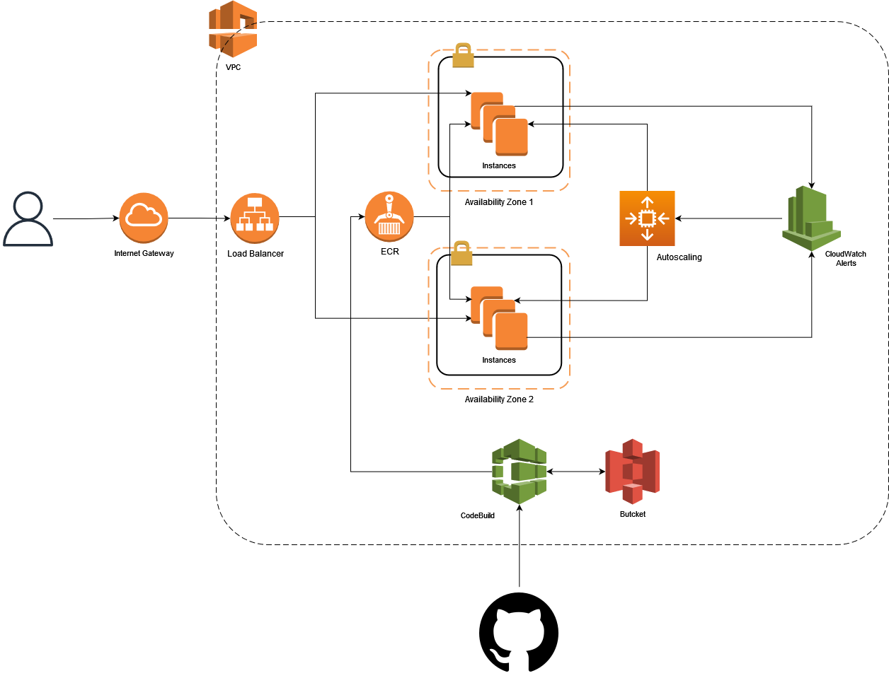
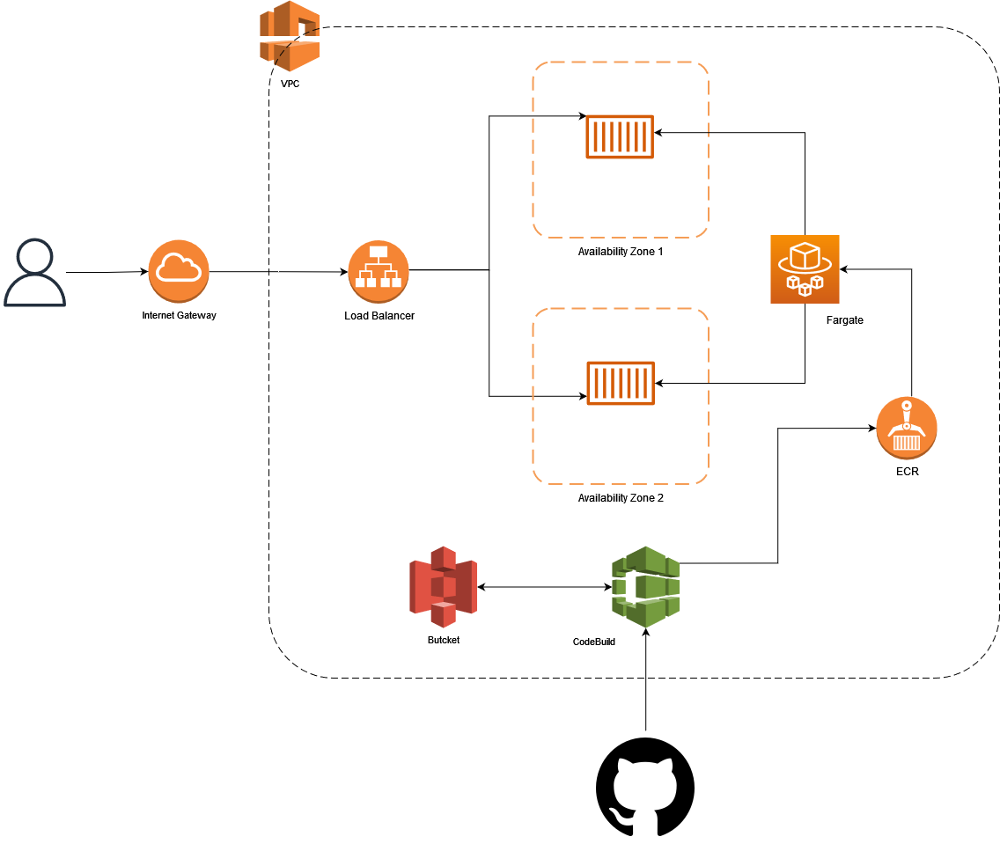

# Important considerations:

1. The current repository contains the code taken from the public repository [timeoff-management-application](https://github.com/timeoff-management/timeoff-management-application).
2. The Dockerfile was modified in order to install python3 and sqlite.
3. The current proposal contains 2 ways to deploy the app and the nedded infrastructure due my interest on testing the app with and without the Dockerfile.

# Proposals

## EC2 instance - autoscaling group
Considering that the application can be deployed using Docker, the application can be deployed using the following resources, as shown in the image below:

1. EC2 instances
2. Autodeployment Group
3. Security Groups
4. Cloud Watch Alerts
5. VPC
6. Subnets
7. Internet Gateway
8. Load Balancer
9. ECR
10. Code Build
11. Code pipeline
12. S3 bucket (used to save binaries if needed)

## ECS cluster - Fargate

Deploy the Docker image using Fargate in a ECS cluster.

1. Fargate - ECS
2. ECR
3. VPC
4. Subnets
5. Security Groups
6. Internet Gateway
7. Load Balancer
8. Code Deploy
9. Code Build
10. Code pipeline
11. S3 bucket (used to save binaries if needed)

## Important instructions

1. Mofidy **variables.auto.tfvar** file and set the variables values as needed, considering that ``infra_type`` variable can bet set to "ec2_autoscaling_group" or to "ecs_cluster". 
2. Depending on the ``infra_type``, terraform will create first the infrastructure for the aplication and then the deployment pipeline (Code pipeline + Code build + Code deploy).

## Posible improvements

* Execute docker commands using the "user_data" parameter during the instances creation.
* Add commands using Docker Deploy on Code pipeline so Docker update the running containers when a new deployment is done.
* Add a database so the app share the information across all the instances in all the availability zones.
* Add alerts using cloudwatch and autoscaling groups to scale the containe number on ECS.
* Add bucket as backed to save the terraform state